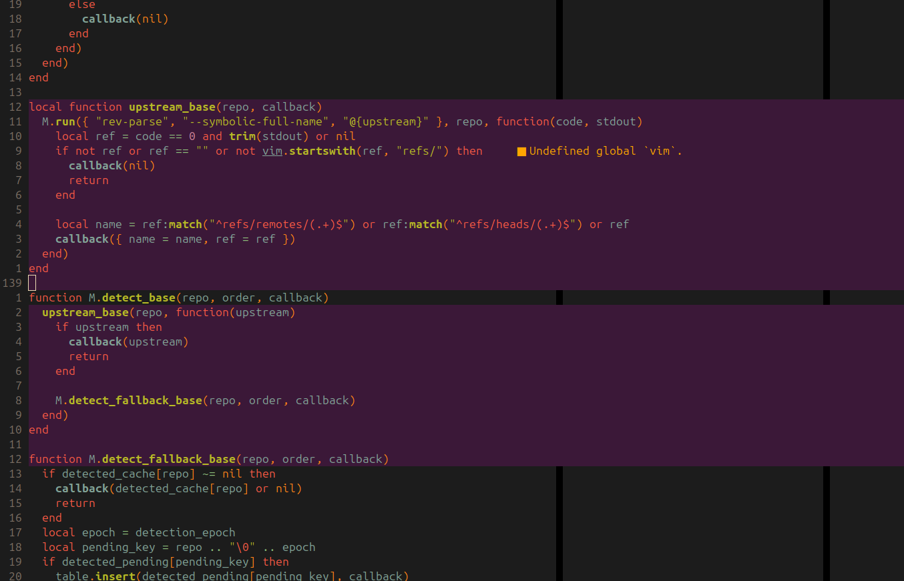

# 🦩 hotlines.nvim

Keep your branch's work impossible to miss.

`hotlines.nvim` uses diff-inspired highlights to keep branch work visible as you
navigate, edit, and review: added lines are rose-magenta, modified lines are deep
magenta, and the changed text within modified lines is brighter flamingo pink.
Instead of showing only the last commit, it compares the live buffer with the
merge base of your branch and its base branch.



*Changed lines are filled across the editor, keeping branch-specific work visible
without adding signs, gutter markers, or an inline diff.*

Unsaved edits count too. The plugin reads the file at the merge base with
asynchronous Git commands and compares it with the current buffer using
`vim.diff`.

## Why Hotlines?

Feature branches often gather a long series of commits before they are ready to
merge. When that happens, it is useful to see the overall shape of the work:
every line in the current file that differs from the branch you intend to merge
into, not just the change from the last commit or the current worktree state.

`hotlines.nvim` complements plugins such as
[gitsigns.nvim](https://github.com/lewis6991/gitsigns.nvim) and
[vim-gitgutter](https://github.com/airblade/vim-gitgutter); it does not replace
them. Those plugins provide precise signs, hunks, and diff actions for the
changes immediately at hand. Hotlines intentionally shows only hot lines: a
quiet, full-buffer overview of your branch's accumulated changes. Use it to keep
the big picture in view, then use your Git plugin or a diff when you need detail.

## Requirements

- Neovim 0.10 or newer
- Git

## Installation

With [lazy.nvim](https://github.com/folke/lazy.nvim):

```lua
{
  "you/hotlines.nvim",
  event = "BufReadPost",
  opts = {
    -- base = "develop",
  },
}
```

Replace `you` with the repository owner after publishing the plugin.

## Configuration

```lua
require("hotlines").setup({
  base = nil,
  theme = "flamingo",
  highlight = "BranchChanged",
  added_highlight = "BranchAdded",
  changed_text_highlight = "BranchChangedText",
  deleted_highlight = "BranchDeleted",
  enabled_on_start = true,
  default_bg = "#3b1838",
  added_default_bg = "#512344",
  changed_text_default_bg = "#71335f",
  deleted_default_bg = "#1e0c1c",
  live_update = true,
  debounce_ms = 200,
  diff_style = "unified",
  keymaps = {
    toggle = "<leader>ht",
    next = "<leader>hn",
    prev = "<leader>hb",
    diff = "<leader>hd",
    files = "<leader>hf",
  },
})
```

`theme` accepts `"flamingo"`, `"classic"`, `"sunset"`, `"aurora"`, `"ember"`,
or `"custom"`. Flamingo is the default rose-magenta palette. Classic uses
green additions, blue modifications, and dark-red deletion markers. Sunset uses
coral and violet, Aurora uses teal and indigo, and Ember uses ochre and amber.
Custom uses the configured highlight groups and default backgrounds below, so it
is the mode to select when defining your own colors.

When `base` is unset, the plugin detects the branch origin from the current local
branch's reflog. It uses Git's `branch: Created from <ref>` entry, or the matching
`HEAD` checkout entry when Git recorded `Created from HEAD`. Detection does not
guess from the configured upstream, `origin/HEAD`, `main`, or `master`; those refs
do not establish where a branch was created. If the creation evidence has expired,
is ambiguous, or cannot be resolved, the plugin compares the branch with itself.
This highlights working-tree and unsaved edits without treating committed history
as branch changes. Use `:HotlinesSetBase {branch}` to choose another base. The
selected base lasts for the current Neovim session only. Detection and comparison
data are cached for the current branch.

Configured highlight groups are left unchanged if they already exist. Otherwise,
the plugin defines `added_highlight`, `highlight`, `changed_text_highlight`, and
`deleted_highlight` using their matching default backgrounds. Named themes use
their own internal groups and leave your groups untouched. `highlight` remains
the modified-line group from earlier versions; use `theme = "custom"` to
customize additions and changed text independently.

To use different colors with lazy.nvim, define the groups in `init` so they exist
before the plugin loads:

```lua
{
  "you/hotlines.nvim",
  event = "BufReadPost",
  init = function()
    vim.api.nvim_set_hl(0, "BranchAdded", { bg = "#512344" })
    vim.api.nvim_set_hl(0, "BranchChanged", { bg = "#3b1838" })
    vim.api.nvim_set_hl(0, "BranchChangedText", { bg = "#71335f" })
    vim.api.nvim_set_hl(0, "BranchDeleted", { bg = "#1e0c1c" })
  end,
  opts = { theme = "custom" },
}
```

## Commands

| Command | Action |
| --- | --- |
| `:HotlinesEnable` | Enable and refresh the current buffer |
| `:HotlinesDisable` | Disable and clear the current buffer |
| `:HotlinesToggle` | Toggle the current buffer |
| `:HotlinesSetBase {branch}` | Set the base and refresh tracked buffers |
| `:HotlinesSetBase` | Clear the configured base and detect the branch origin again |
| `:HotlinesTheme {theme}` | Change the highlight theme for this Neovim session |
| `:HotlinesRefresh` | Invalidate comparison caches and refresh the current buffer |
| `:HotlinesInfo` | Show the resolved repository, base, merge base, and change counts |
| `:HotlinesNext` | Jump to the next changed hunk, wrapping at the end |
| `:HotlinesPrev` | Jump to the previous changed hunk, wrapping at the start |
| `:HotlinesDiff [unified|split]` | Open the current hunk diff, unified by default |
| `:HotlinesTouchedFiles` | Open the branch touched-files panel |

`HotlinesSetBase` accepts local branches, fully qualified refs, and branches from
any remote, such as `team/integration`. Completion lists local and remote branches
after the current repository has been resolved by an initial refresh.

## Keybindings

| Key | Action |
| --- | --- |
| `<leader>ht` | Toggle hotlines in the current buffer |
| `<leader>hn` | Jump to the next changed hunk |
| `<leader>hb` | Jump to the previous changed hunk |
| `<leader>hd` | Open the current hunk diff, unified by default |
| `<leader>hf` | Open the branch touched-files panel |

Set an entry in `keymaps` to `false` to leave that action unmapped.

The default unified hunk diff opens a highlighted floating buffer with three lines
of context above and below the hunk. Use `:HotlinesDiff split`, or configure
`diff_style = "split"`, for read-only merge-base and current buffers side by side
in Neovim's native diff mode with synchronized scrolling. Press `q` or the diff
keybinding again to close the diff.

To diff removed code, place the cursor on either line beside its dark-red
deletion marker and use the diff keybinding.

## Touched Files

`:HotlinesTouchedFiles` opens a centered, dependency-free picker with touched files
and hunks on the left and a unified diff preview on the right. Moving over a file
previews all of its changes; moving over a hunk previews and positions the right
pane at only that hunk. It starts as a flat list; press `t` to switch to a folder
tree. Use `o` to expand or collapse a folder or file, `a` to expand all, and `c`
to collapse all. Press `<CR>` to open the selected file or hunk location, `d` to
open a hunk diff, and `f` to focus the live filter field below the list. Press
`<CR>` or `<Esc>` to return to the results,
`<C-d>` or `<C-u>` to scroll the preview, `r` to refresh, and `q` to close. Focus
stays in the left pane so more files can be opened before closing it. A filter
temporarily expands
matching paths; a file-path match shows all of its hunks, while a hunk-only match
shows only the matching hunks. The current file or hunk remains selected when the
picker rerenders. Each file displays colored added (`+`), deleted (`-`), and
modified (`~`) line totals. The results and preview panes include one column of
left padding inside their borders.

Filetype icons and their colors are shown automatically when
[mini.icons](https://github.com/echasnovski/mini.icons) or
[nvim-web-devicons](https://github.com/nvim-tree/nvim-web-devicons) is installed.
Neither plugin is required; filenames remain unadorned when no icon provider is
available.

The unified preview combines its add, delete, and hunk colors with Tree-sitter
source highlighting when a parser and highlights query are available for the
selected filetype. Missing parsers fall back to standard diff highlighting.

`get_touched_files(callback, opts)` asynchronously provides picker-agnostic data
for every navigable file changed since the merge base. This includes committed,
staged, unstaged, and untracked files. Deleted files are omitted because they
cannot be opened. The callback receives `(files, error, context)`: `files` is a
sorted array of absolute path strings, while `context` contains `repo`, `base`,
and `merge_base`. Pass `opts.cwd` to select a repository explicitly; otherwise
the current buffer or working directory is used.

`get_touched_file_hunks(callback, opts)` provides the same context with file
entries containing their changed hunks and the live text used for comparison.

No picker is required by Hotlines. For
[fzf-lua](https://github.com/ibhagwan/fzf-lua), a keybinding can pass the array
directly to `fzf_exec`:

```lua
vim.keymap.set("n", "<leader>hf", function()
  require("hotlines").get_touched_files(function(files, err)
    if err then
      vim.notify("hotlines.nvim: " .. err, vim.log.levels.WARN)
      return
    end
    local fzf = require("fzf-lua")
    fzf.fzf_exec(files, {
      prompt = "Hotlines> ",
      previewer = "builtin",
      actions = {
        enter = fzf.actions.file_edit,
      },
    })
  end)
end, { desc = "Hotlines touched files" })
```

For [telescope.nvim](https://github.com/nvim-telescope/telescope.nvim), use the
same array as a table finder:

```lua
vim.keymap.set("n", "<leader>hf", function()
  require("hotlines").get_touched_files(function(files, err)
    if err then
      vim.notify("hotlines.nvim: " .. err, vim.log.levels.WARN)
      return
    end
    local opts = {}
    local config = require("telescope.config").values
    require("telescope.pickers").new(opts, {
      prompt_title = "Hotlines",
      finder = require("telescope.finders").new_table({
        results = files,
        entry_maker = require("telescope.make_entry").gen_from_file(opts),
      }),
      previewer = config.file_previewer(opts),
      sorter = config.file_sorter(opts),
    }):find()
  end)
end, { desc = "Hotlines touched files" })
```

Only normal buffers backed by existing files inside a Git work tree are handled.
Pure deletions appear as virtual dark-red lines beside their adjacent code.

## Development

Run the headless integration suite with:

```sh
make test
```
